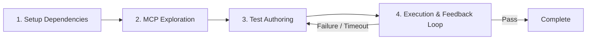

# Comprehensive Testing Guide — `todo_riverpod`

This guide explains how unit testing and End-to-End (E2E) integration testing are implemented in the `todo_riverpod` codebase, along with step-by-step instructions on how to execute and verify them, including using the `flutter-add-integration-test` Agent Skill.

---

## Architecture Overview

The `todo_riverpod` application follows a multi-layered testing strategy:

```mermaid
flowchart TD
    subgraph Unit & Integration Tests (test/)
        DB[Database Layer Tests] -->|In-memory SQLite| AppDB[AppDatabase]
        Actions[TodoActions Tests] -->|ProviderContainer Override| DB
        State[ThemeModeState Tests] -->|Mocked SharedPreferences| Settings[SettingsProvider]
        Stream[TodoListProvider Tests] -->|Stream Assertions| StreamSub[ProviderSubscription]
        Router[AppRouter Tests] -->|GoRouter Navigation| RouterView[Screen Widgets]
    end

    subgraph E2E Tests (integration_test/ & test_driver/)
        E2E[todo_app_test.dart] -->|WidgetTester & Driver| App[Full App Workflow]
    end
```

---

## 1. Unit & Widget Testing Strategy (`test/`)

Unit and component tests verify individual layers in isolation without requiring physical devices or desktop application instances.

### 1.1 Database Tests (`test/database/app_database_test.dart`)

- **Isolation**: Uses `AppDatabase.forTesting(NativeDatabase.memory())` to run SQLite completely in-memory.
- **Coverage**:
  - **CRUD**: Validates `insertTodo`, `getTodoById`, `updateTodo` (replace), and `deleteTodo`.
  - **Reactivity**: Verifies `watchAllTodos()` and `watchTodoById()` emit updated values on insert, update, and deletion.
  - **Schema Constraints**: Tests title length boundary rules (rejects empty string `""` and titles `> 200` characters, accepts `200` characters).

### 1.2 Provider Actions Tests (`test/providers/todo_actions_test.dart`)

- **Isolation**: Evaluates `TodoActions` using a `ProviderContainer` with `appDatabaseProvider` overridden by an in-memory DB instance.
- **Coverage**:
  - `addTodo`: Verifies creation with default `isCompleted = false` and generated timestamps.
  - `updateTodo`: Ensures `isCompleted` and `createdAt` are preserved while `updatedAt` is updated.
  - `toggleCompleted`: Tests boolean inversion (`false` ➔ `true` ➔ `false`) and error handling on invalid IDs.
  - `deleteTodo`: Tests row removal and idempotency for non-existent IDs.

### 1.3 Settings Provider Tests (`test/providers/settings_provider_test.dart`)

- **Isolation**: Uses `SharedPreferences.setMockInitialValues({})` and overrides `sharedPreferencesProvider`.
- **Coverage**:
  - Defaulting to `ThemeMode.system` when unset.
  - Reading persisted integer values from key `'theme_mode'`.
  - Persistence round-tripping across `ProviderContainer` teardown and rebuild for all `ThemeMode` enum options (`system`, `light`, `dark`).

### 1.4 Todo List Provider Tests (`test/providers/todo_list_provider_test.dart`)

- **Isolation**: Subscribes to `todoListProvider` stream using `ProviderContainer.listen`.
- **Coverage**:
  - Initial `AsyncValue.data([])` emission.
  - Stream reactivity upon database operations (`addTodo`, `toggleCompleted`, `deleteTodo`).

### 1.5 Router Tests (`test/router/app_router_test.dart`)

- **Isolation**: Mounts `TodoApp` with GoRouter within widget test framework.
- **Coverage**:
  - `/` loads `TodoListScreen`.
  - `/add` loads `AddEditTodoScreen` in creation mode.
  - `/edit/:id` pre-fills details when given a valid numeric ID.
  - `/edit/abc` and invalid IDs fall back safely to `TodoListScreen`.
  - `/settings` loads `SettingsScreen`.

---

## 2. End-to-End (E2E) Integration Testing (`integration_test/` & `test_driver/`)

E2E tests simulate user interaction across the entire stack using `integration_test` and `test_driver`.

### 2.1 Test Driver Configuration (`test_driver/integration_test.dart`)

Exposes the standard entry point required by `flutter drive`:

```dart
import 'package:integration_test/integration_test_driver.dart';

Future<void> main() => integrationDriver();
```

### 2.2 E2E Test Suite (`integration_test/todo_app_test.dart`)

Contains 9 automated scenarios verifying full user journeys:

| # | Scenario | Verification |
| --- | --- | --- |
| 1 | Empty State | Verifies `"No todos yet"` placeholder on initial launch. |
| 2 | Add Todo | Taps FAB ➔ fills title/description ➔ taps Add ➔ verifies card on home screen. |
| 3 | Form Validation | Taps Add on empty form ➔ verifies error text `"Please enter a title"` and prevents navigation. |
| 4 | Toggle Completed | Taps item checkbox ➔ verifies `TextDecoration.lineThrough` and greyed styling ➔ toggles back. |
| 5 | Pre-filled Edit | Opens popup menu ➔ taps Edit ➔ verifies fields pre-filled ➔ modifies text ➔ verifies update. |
| 6 | Delete Flow | Opens popup menu ➔ taps Delete ➔ tests Cancel (todo retained) ➔ repeats & confirms Delete (todo removed). |
| 7 | Settings Navigation | Taps header gear icon ➔ verifies presence of 3 theme radio tiles (`System Default`, `Light`, `Dark`). |
| 8 | Theme Change | Selects `Dark` ➔ verifies `MaterialApp.themeMode` converts to `ThemeMode.dark`. |
| 9 | State Persistence | Adds todo & sets Dark mode ➔ unmounts app ➔ relaunches ➔ verifies todo and theme persist. |

---

## 3. Using Agent Skill `flutter-add-integration-test` for Agentic Coding

The project includes the [`flutter-add-integration-test`](file:///D:/live/todo_riverpod/.agents/skills/flutter-add-integration-test/SKILL.md) Agent Skill. This skill defines a structured, agentic workflow for exploring the UI via MCP, authoring integration tests, and diagnosing execution failures.



### 3.1 Workflow Steps for AI Agents & Developers

1. **Setup Dependencies & Keys**:
   - Verify `integration_test` and `flutter_test` are present in `pubspec.yaml`.
   - Add `ValueKey` identifiers to target widgets (e.g., `ValueKey('add_todo_fab')`) for unambiguous locator matching.
   - If using Flutter Driver extensions, invoke `enableFlutterDriverExtension()` in `lib/main_test.dart`.

2. **Interactive UI Exploration via Dart/Flutter MCP**:
   - Launch app instance with `launch_app` to retrieve Dart Tooling Daemon (DTD) URI.
   - Map widget hierarchy with `get_widget_tree` to discover keys, types, and labels.
   - Test interaction steps live using MCP tools (`tap`, `enter_text`, `scroll`).

3. **Authoring Test Files**:
   - Place tests under `integration_test/<feature>_test.dart`.
   - Call `IntegrationTestWidgetsFlutterBinding.ensureInitialized()` at the top of `main()`.
   - Use `WidgetTester` APIs (`tester.pumpWidget`, `tester.tap`, `tester.enterText`, `tester.pumpAndSettle`).

4. **Execution & Feedback Loop**:
   - Run tests using `flutter test -d windows integration_test/<feature>_test.dart` or `flutter drive`.
   - **Error Recovery**:
     - *`PumpAndSettleTimedOutException`*: Check for un-ended animations or repeating timers (`CircularProgressIndicator`).
     - *Widget not found*: Use `tester.scrollUntilVisible` for items inside `ListView` or `SliverList`.
     - *Stale database state*: Add a `resetState()` setup hook to clear database tables and `SharedPreferences` between test runs.

---

## 4. How to Run & Verify Tests

### 4.1 Static Analysis & Formatting Checks

Run these commands after making changes to verify code formatting and static analysis rules:

```bash
# Run static analysis
dart analyze lib/ test/ integration_test/ test_driver/

# Verify formatting
dart format --output=none --set-exit-if-changed lib/ test/ integration_test/ test_driver/
```

### 4.2 Running Unit & Widget Tests

Execute all unit and widget tests headlessly:

```bash
flutter test
```

To run a specific test file:

```bash
flutter test test/database/app_database_test.dart
```

### 4.3 Running E2E Integration Tests

#### Option A: Running via `flutter test` (Widget/Target Mode)

You can run integration tests directly against your desktop platform target (e.g., Windows):

```bash
flutter test -d windows integration_test/todo_app_test.dart
```

#### Option B: Running via `flutter drive` (Full Flutter Driver Mode)

To run via the `test_driver` integration runner:

```bash
flutter drive --driver=test_driver/integration_test.dart --target=integration_test/todo_app_test.dart -d windows
```

---

## 5. Code Generation Reminder

If you modify schema models or Riverpod providers marked with `@riverpod` or `@DriftDatabase`, remember to regenerate code before testing:

```bash
dart run build_runner build --delete-conflicting-outputs
```
