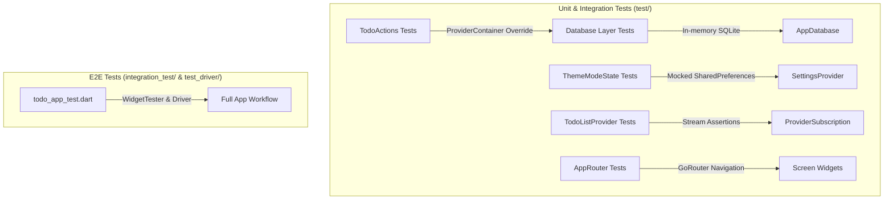
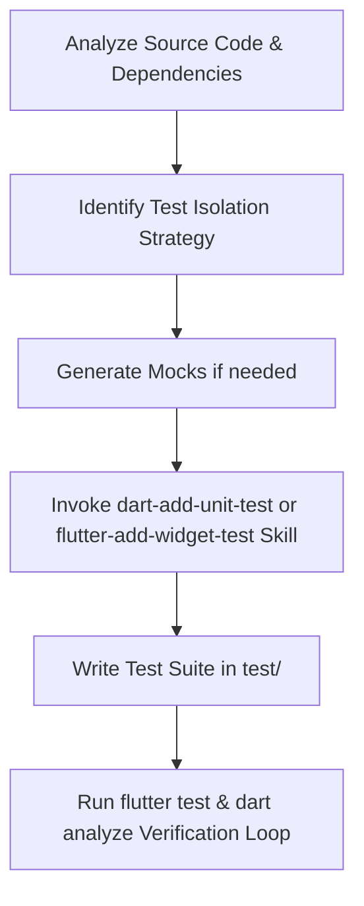
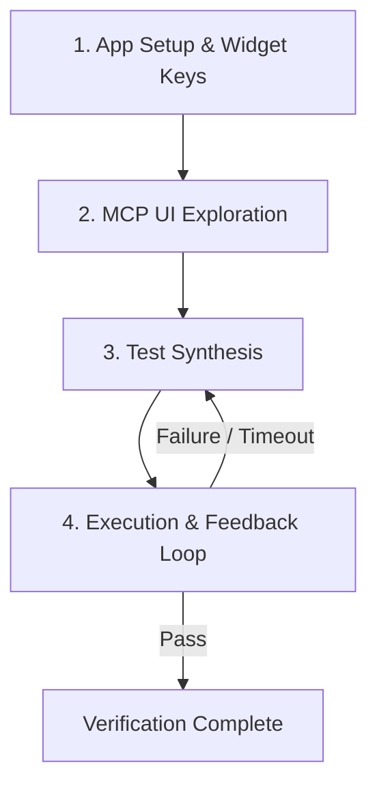

# Comprehensive Testing Guide — `todo_riverpod`

This guide explains how unit testing and End-to-End (E2E) integration testing are implemented in the `todo_riverpod` codebase, along with step-by-step instructions on how to execute and verify them, including using the `flutter-add-integration-test` Agent Skill.

---

## Architecture Overview

The `todo_riverpod` application follows a multi-layered testing strategy:



---

## 1. Unit & Widget Testing Strategy (`test/`)

Unit and component tests verify individual layers in isolation without requiring physical devices or desktop application instances.

### 1.1 Database Tests (`test/database/app_database_test.dart`)

- **Isolation**: Uses `AppDatabase.forTesting(NativeDatabase.memory())` to run SQLite completely in-memory.
- **Coverage**:
  - **CRUD**: Validates `insertTodo`, `getTodoById`, `updateTodo` (replace), and `deleteTodo`.
  - **Reactivity**: Verifies `watchAllTodos()` and `watchTodoById()` emit updated values on insert, update, and deletion.
  - **Schema Constraints**: Tests title length boundary rules (rejects empty string `""` and titles `> 200` characters, accepts `200` characters).

### 1.2 Provider Actions Tests (`test/providers/todo_actions_test.dart`)

- **Isolation**: Evaluates `TodoActions` using a `ProviderContainer` with `appDatabaseProvider` overridden by an in-memory DB instance.
- **Coverage**:
  - `addTodo`: Verifies creation with default `isCompleted = false` and generated timestamps.
  - `updateTodo`: Ensures `isCompleted` and `createdAt` are preserved while `updatedAt` is updated.
  - `toggleCompleted`: Tests boolean inversion (`false` ➔ `true` ➔ `false`) and error handling on invalid IDs.
  - `deleteTodo`: Tests row removal and idempotency for non-existent IDs.

### 1.3 Settings Provider Tests (`test/providers/settings_provider_test.dart`)

- **Isolation**: Uses `SharedPreferences.setMockInitialValues({})` and overrides `sharedPreferencesProvider`.
- **Coverage**:
  - Defaulting to `ThemeMode.system` when unset.
  - Reading persisted integer values from key `'theme_mode'`.
  - Persistence round-tripping across `ProviderContainer` teardown and rebuild for all `ThemeMode` enum options (`system`, `light`, `dark`).

### 1.4 Todo List Provider Tests (`test/providers/todo_list_provider_test.dart`)

- **Isolation**: Subscribes to `todoListProvider` stream using `ProviderContainer.listen`.
- **Coverage**:
  - Initial `AsyncValue.data([])` emission.
  - Stream reactivity upon database operations (`addTodo`, `toggleCompleted`, `deleteTodo`).

### 1.5 Router Tests (`test/router/app_router_test.dart`)

- **Isolation**: Mounts `TodoApp` with GoRouter within widget test framework.
- **Coverage**:
  - `/` loads `TodoListScreen`.
  - `/add` loads `AddEditTodoScreen` in creation mode.
  - `/edit/:id` pre-fills details when given a valid numeric ID.
  - `/edit/abc` and invalid IDs fall back safely to `TodoListScreen`.
  - `/settings` loads `SettingsScreen`.

---

## 2. End-to-End (E2E) Integration Testing (`integration_test/` & `test_driver/`)

E2E tests simulate user interaction across the entire stack using `integration_test` and `test_driver`.

### 2.1 Test Driver Configuration (`test_driver/integration_test.dart`)

Exposes the standard entry point required by `flutter drive`:

```dart
import 'package:integration_test/integration_test_driver.dart';

Future<void> main() => integrationDriver();
```

### 2.2 E2E Test Suite (`integration_test/todo_app_test.dart`)

Contains 9 automated scenarios verifying full user journeys:

| # | Scenario | Verification |
| --- | --- | --- |
| 1 | Empty State | Verifies `"No todos yet"` placeholder on initial launch. |
| 2 | Add Todo | Taps FAB ➔ fills title/description ➔ taps Add ➔ verifies card on home screen. |
| 3 | Form Validation | Taps Add on empty form ➔ verifies error text `"Please enter a title"` and prevents navigation. |
| 4 | Toggle Completed | Taps item checkbox ➔ verifies `TextDecoration.lineThrough` and greyed styling ➔ toggles back. |
| 5 | Pre-filled Edit | Opens popup menu ➔ taps Edit ➔ verifies fields pre-filled ➔ modifies text ➔ verifies update. |
| 6 | Delete Flow | Opens popup menu ➔ taps Delete ➔ tests Cancel (todo retained) ➔ repeats & confirms Delete (todo removed). |
| 7 | Settings Navigation | Taps header gear icon ➔ verifies presence of 3 theme radio tiles (`System Default`, `Light`, `Dark`). |
| 8 | Theme Change | Selects `Dark` ➔ verifies `MaterialApp.themeMode` converts to `ThemeMode.dark`. |
| 9 | State Persistence | Adds todo & sets Dark mode ➔ unmounts app ➔ relaunches ➔ verifies todo and theme persist. |

---

## 3. Agentic Testing Workflows: Using Coding Agents & Flutter Skills

AI coding agents (like `opencode`) leverage structured agent skills and MCP tools to autonomously analyze codebases, generate unit/widget test suites, and author E2E integration tests.

### 3.1 Overview of Flutter Testing Agent Skills

The codebase includes specialized Flutter agent skills in `.agents/skills/`:

| Agent Skill | Purpose & Usage |
| --- | --- |
| `dart-add-unit-test` | Creates unit tests for Dart functions, Drift database models, and Riverpod state logic using `package:test` / `flutter_test`. |
| `flutter-add-widget-test` | Authors component-level widget tests using `WidgetTester` to verify UI rendering, layout, and user interactions. |
| `dart-generate-test-mocks` | Generates type-safe mock objects using `package:mockito` and `build_runner` for external services or dependencies. |
| `flutter-add-integration-test` | Explores live UI via Flutter MCP, verifies widget trees, and synthesizes complete E2E integration tests. |
| `dart-run-static-analysis` | Executes `dart analyze` and applies mechanical fixes via `dart fix --apply`. |

---

### 3.2 Using a Coding Agent to Create Unit & Widget Test Cases

When instructed to create unit or widget test cases for a new or existing feature, the coding agent follows a structured workflow:



1. **Code Analysis & Context Gathering**:
   - The agent inspects the target source file (e.g., database DAO, Riverpod provider, or screen widget) using `read` and `grep`.
   - It identifies key edge cases, validation logic, state changes, and expected stream emissions.

2. **Selecting the Isolation Strategy**:
   - **Database**: Uses `AppDatabase.forTesting(NativeDatabase.memory())` for zero-side-effect SQLite operations.
   - **Riverpod Providers**: Instantiates a `ProviderContainer` with overridden dependencies (e.g., overriding `appDatabaseProvider` or `sharedPreferencesProvider`).
   - **Widget Components**: Wraps widgets in `MaterialApp` or Riverpod `ProviderScope` within `tester.pumpWidget()`.

3. **Generating Test Cases**:
   - Applies the `dart-add-unit-test` skill to format assertions, group test cases logically with `group()`, and handle async streams or futures.
   - Applies the `flutter-add-widget-test` skill to locate widgets via `find.byKey`, `find.byType`, or `find.text`, simulate gestures (`tester.tap`, `tester.enterText`), and rebuild the tree using `tester.pumpAndSettle()`.

4. **Self-Verification & Refinement**:
   - Runs `flutter test test/<file>_test.dart` to verify pass status.
   - Runs `dart analyze lib/ test/` to verify zero static analysis errors.

---

### 3.3 Creating Integration Tests with `flutter-add-integration-test` Skill

The [`flutter-add-integration-test`](https://github.com/anoochit/todo_riverpod_drift/blob/main/.agents/skills/flutter-add-integration-test/SKILL.md) skill guides agents through interactive UI exploration and test generation across 4 key phases:



#### Phase 1: App Setup & Key Assignment
- The agent ensures `integration_test` and `flutter_test` dependencies are present in `pubspec.yaml`.
- The agent assigns unique `ValueKey` identifiers to target interactive elements (e.g., `ValueKey('add_todo_fab')`, `ValueKey('todo_title_input')`).
- If required, the agent enables `enableFlutterDriverExtension()` in `lib/main_test.dart`.

#### Phase 2: Interactive Exploration via Dart/Flutter MCP
- The agent launches the app using `launch_app` to retrieve the Dart Tooling Daemon (DTD) connection URI.
- It inspects the live widget tree with `get_widget_tree` to map visible keys, widget types, and semantic labels.
- It tests live interaction sequences (`tap`, `enter_text`, `scroll`) using MCP tools to confirm user flow paths before writing code.

#### Phase 3: Synthesizing Integration Test Suites
- The agent creates or updates test scripts under `integration_test/<feature>_test.dart`.
- Structure template synthesized by agent:
  ```dart
  import 'package:flutter/material.dart';
  import 'package:flutter_test/flutter_test.dart';
  import 'package:integration_test/integration_test.dart';
  import 'package:todo_riverpod/main.dart' as app;

  void main() {
    IntegrationTestWidgetsFlutterBinding.ensureInitialized();

    group('E2E Feature Test', () {
      testWidgets('Complete user workflow', (WidgetTester tester) async {
        app.main();
        await tester.pumpAndSettle();

        // 1. Interact with UI
        final fab = find.byKey(const ValueKey('add_todo_fab'));
        await tester.tap(fab);
        await tester.pumpAndSettle();

        // 2. Form input
        await tester.enterText(find.byKey(const ValueKey('title_input')), 'New Task');
        await tester.tap(find.byKey(const ValueKey('save_button')));
        await tester.pumpAndSettle();

        // 3. Verify outcome
        expect(find.text('New Task'), findsOneWidget);
      });
    });
  }
  ```
- Also creates the companion host driver script at `test_driver/integration_test.dart`:
  ```dart
  import 'package:integration_test/integration_test_driver.dart';

  Future<void> main() => integrationDriver();
  ```

#### Phase 4: Execution & Feedback Loop
- The agent executes tests using desktop or driver target modes:
  ```bash
  flutter test -d windows integration_test/todo_app_test.dart
  ```
- **Error Recovery Strategies Applied by Agent**:
  - *`PumpAndSettleTimedOutException`*: Replace `pumpAndSettle()` with discrete `pump(Duration(...))` calls if infinite progress indicators or repeating timers exist.
  - *`StateError / Bad state: No element`*: Ensure off-screen list items are scrolled into view with `tester.scrollUntilVisible()`.
  - *Stale database state*: Inject test tearDown/setUp database reset hooks.

---

### 3.4 Example Prompts to Direct the Coding Agent

Below are practical prompts you can use to instruct a coding agent to build test cases using these skills:

#### Prompt 1: Generate Unit Tests for a Riverpod Provider
> "Use the `dart-add-unit-test` skill to write comprehensive unit tests for `TodoActions` provider in `test/providers/todo_actions_test.dart`. Test adding, editing, toggling completion status, and deleting todos using an in-memory Drift database."

#### Prompt 2: Generate Widget Tests for a UI Component
> "Use the `flutter-add-widget-test` skill to create widget tests for `AddEditTodoScreen` in `test/screens/add_edit_todo_screen_test.dart`. Test form validation when title is empty, pre-filling text fields during edit mode, and tapping the save button."

#### Prompt 3: Create an E2E Integration Test using `flutter-add-integration-test`
> "Use the `flutter-add-integration-test` skill to explore the app via Flutter MCP tools and create an E2E integration test in `integration_test/settings_theme_test.dart`. Test navigating to settings, changing theme mode to Dark, and asserting that theme state persists after relaunching."

---

## 4. How to Run & Verify Tests

### 4.1 Static Analysis & Formatting Checks

Run these commands after making changes to verify code formatting and static analysis rules:

```bash
# Run static analysis
dart analyze lib/ test/ integration_test/ test_driver/

# Verify formatting
dart format --output=none --set-exit-if-changed lib/ test/ integration_test/ test_driver/
```

### 4.2 Running Unit & Widget Tests

Execute all unit and widget tests headlessly:

```bash
flutter test
```

To run a specific test file:

```bash
flutter test test/database/app_database_test.dart
```

### 4.3 Running E2E Integration Tests

#### Option A: Running via `flutter test` (Widget/Target Mode)

You can run integration tests directly against your desktop platform target (e.g., Windows):

```bash
flutter test -d windows integration_test/todo_app_test.dart
```

#### Option B: Running via `flutter drive` (Full Flutter Driver Mode)

To run via the `test_driver` integration runner:

```bash
flutter drive --driver=test_driver/integration_test.dart --target=integration_test/todo_app_test.dart -d windows
```

---

## 5. Code Generation Reminder

If you modify schema models or Riverpod providers marked with `@riverpod` or `@DriftDatabase`, remember to regenerate code before testing:

```bash
dart run build_runner build --delete-conflicting-outputs
```
